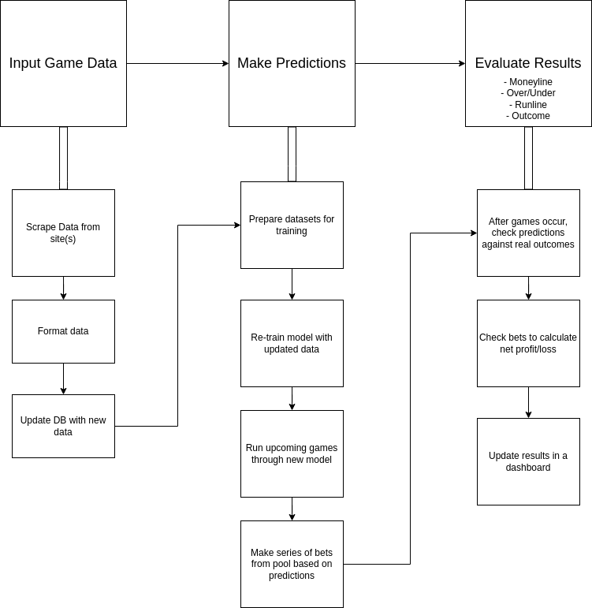

# MLB Game Prediction
Developed by Jacob Sutton, 2023

*** WORK IN PROGRESS. SEE JUPYTER FILES FOR WORKING SCRIPT

## Introduction
The goal of this project is to accurately predict the winner of MLB baseball games. 

The way I will test whether or not the system can accurately predict the winners of MLB baseball games is by testing the accuracy of the system against the 2023 season. The project will be continued by enabling the system to predict the winner of the 2023 World Series. The end result of the project is to be a interactive UI that allows a user to enter the details of a future game and find out who will win, and by what confidence. 

This is an interesting and useful solution. If accurate, the system could be used in a wide variety of applications within sports betting as well as by organizations to make better decisions. 

## Diagram

## Outline

#### Scrape Sportsbook Data

It looks like there multiple sportsbooks that a I can use to get the true outcome of the games that I will be trying to predict. 

Sportsbooks:
  
1. Yahoo Sports: https://sports.yahoo.com/mlb/odds/
2. Draft Kings: https://sportsbook.draftkings.com/leagues/baseball/mlb
3. Sportsline: https://www.sportsline.com/mlb/odds/
4. OddsShark: https://www.oddsshark.com/mlb/odds

  
  - So I will need to create a script that goes to these sites, scrape the odds data for the games, and then save that data. 

#### Scrape MLB Game Data

I will need to scrape relavant baseball data from sites so that I can keep my DB up-to-date.

I will use sites like:

1. RetroSheet: https://www.retrosheet.org/
  - Limited to previous complete season 1899-2022
2. FanGraphs: https://www.fangraphs.com/
  - For up to date games used to predict odds for

  - So I will need to create a script that goes to these sites and scrapes the data so I have statistics for each game, player, team, etc

#### Clean & Format Data for Use

- Once I have all this data, I need to have a script that I can run to clean and organize the data into a uniform format. 

- I will also need a script that can go through the dataset and pull out subsets of features that I will use to create a series of models
that make the predictions I need

#### Make Model

- Once I have a dataset of features I want to build out a model with, I will need to write a script that trains and evaluates a model.

- Then I will need to go through a standardized analysis to evaluate the model for accuracy 

#### Model Evaluation

- Once I have a model that I am satisfied with I will need to write a script which uses that model:

  1. It will need to make predictions for the metric we are evaluating
  2. The script will then need to use the model's predictions to make a series of bets

  I then want to visulatize the accuarcy of the model and the real-world applied results. 

#### Pipeline Creation

- Once I have a complete series of working models, I want to write a script that builds out the above pipeline in segments
so that I can continue the project, making tweaks with my feature selection, parameter tuning, etc.

#### Further Work

- Once the pipeline is created and in full swing, I want to build out the project so that it can be downloaded and used by other
developers in an effort to both make accuarte predictions as well as money.

## References

I used several wonderful resources from DataQuest to compplete this project. Please see the list for references:
  
  - Web Scraping: https://www.youtube.com/watch?v=o6Ih934hADU&t=3904s&ab_channel=Dataquest
  - Data/ML:
        - 1) https://www.youtube.com/watch?v=ZO3HAVm9IdQ&ab_channel=Dataquest
        - 2) https://www.youtube.com/watch?v=0irmDBWLrco&ab_channel=Dataquest

- Baseball Prediction Tutorial by Numeristical
     - https://www.youtube.com/watch?v=-e5-Ls4yDRs&list=PLeVfk5xTWHYCCqpcNlbRdIXi2CNt9zKvs&ab_channel=numeristical
 

